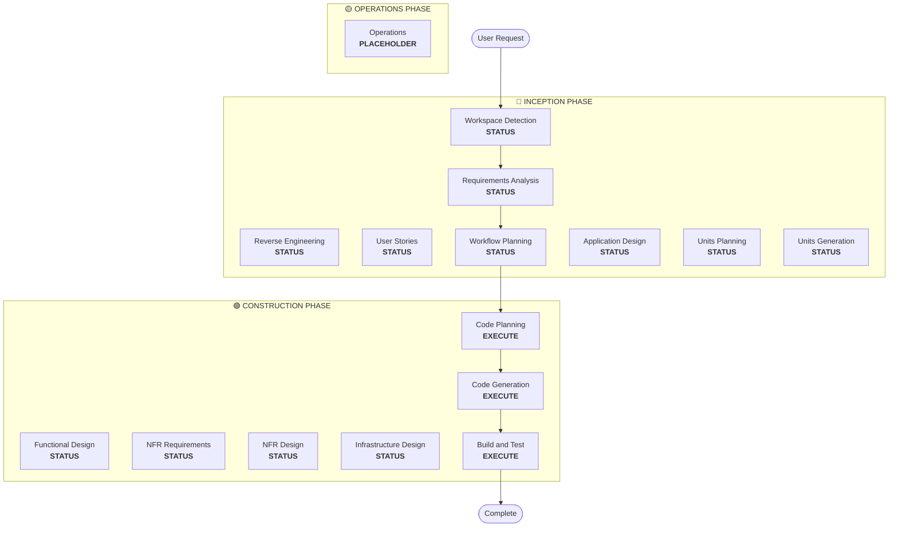

# INCEPTION RULES

PATTERN:COLLECT_ANSWERS = wait for all [Answer]: completed; [REQ] review ALL for vague/ambiguous; [REQ] follow up ANY unclear; watch: "depends", "maybe", "not sure", "mix of", "somewhere between"; block until resolved

PATTERN:APPROVAL_GATE = wait for explicit approval; changes requested → update, re-approve; log approval+response in audit.md with timestamp; mark stage complete in aidlc-state.md

PATTERN:ANALYZE_ANSWERS = [REQ] check ALL answers for: vague/ambiguous ("mix of", "somewhere between", "not sure", "depends", "maybe", "probably"), undefined terms, contradictions, missing details, combined options without decision rules, incomplete explanations, assumption-based responses

PATTERN:MANDATORY_FOLLOWUP = ANY ambiguity detected → create follow-up questions with [Answer]: tags; DO NOT proceed until ALL resolved; examples: "mix of A and B" → ask criteria for A vs B; "not sure" → ask what info needed; "depends on complexity" → ask complexity definition

---

## WORKSPACE_DETECTION

Purpose: determine workspace state + check for existing AI-DLC projects

1. Check `aidlc-docs/aidlc-state.md` exists → resume from last phase | not exists → new project
2. Scan workspace for source code (.java, .py, .js, .ts, .jsx, .tsx, .kt, .kts, .scala, .groovy, .go, .rs, .rb, .php, .c, .h, .cpp, .hpp, .cc, .cs, .fs, etc.) + build files (pom.xml, package.json, build.gradle, etc.); identify workspace root (NOT aidlc-docs/)
3. Empty workspace → brownfield=false, next=Requirements Analysis | existing code → brownfield=true, check for reverse engineering artifacts → artifacts exist → skip to Requirements Analysis | no artifacts → next=Reverse Engineering
4. Create `aidlc-docs/aidlc-state.md`:

```markdown
# AI-DLC State Tracking

## Project Information
- **Project Type**: [Greenfield/Brownfield]
- **Start Date**: [ISO timestamp]
- **Current Stage**: INCEPTION - Workspace Detection

## Workspace State
- **Existing Code**: [Yes/No]
- **Reverse Engineering Needed**: [Yes/No]
- **Workspace Root**: [Absolute path]

## Code Location Rules
- **Application Code**: Workspace root (NEVER in aidlc-docs/)
- **Documentation**: aidlc-docs/ only
- **Structure patterns**: See code-generation.md Critical Rules

## Stage Progress
[Will be populated as workflow progresses]
```

5. Present completion (brownfield):

```markdown
# 🔍 Workspace Detection Complete

Workspace analysis findings:
• **Project Type**: Brownfield project
• [AI-generated summary of workspace findings in bullet points]
• **Next Step**: Proceeding to **Reverse Engineering** to analyze existing codebase...
```

   Present completion (greenfield):

```markdown
# 🔍 Workspace Detection Complete

Workspace analysis findings:
• **Project Type**: Greenfield project
• **Next Step**: Proceeding to **Requirements Analysis**...
```

6. No user approval required; auto-proceed to next phase


---

## REVERSE_ENGINEERING

Purpose: analyze existing codebase, generate comprehensive design artifacts
Execute when: brownfield project (existing code found)
Skip when: greenfield (no existing code)
Rerun behavior: always rerun when brownfield detected, even if artifacts exist (ensures current state)

### Step 1: Multi-Package Discovery

1.1 Scan workspace: all packages, relationships via config files; types: Application, CDK/Infrastructure, Models, Clients, Tests
1.2 Business context: core business, business overview per package, list of business transactions
1.3 Infrastructure: CDK packages, Terraform (.tf), CloudFormation (.yaml/.json), deployment scripts
1.4 Build system: Brazil, Maven, Gradle, npm; config files; build dependencies between packages
1.5 Service architecture: Lambda (handlers, triggers), containers (Docker/ECS), API definitions (Smithy, OpenAPI), data stores (DynamoDB, S3, etc.)
1.6 Code quality: languages, frameworks, test coverage, linting, CI/CD pipelines

### Step 2: Generate Business Overview

Create `aidlc-docs/inception/reverse-engineering/business-overview.md`:

```markdown
# Business Overview

## Business Context Diagram
[Mermaid diagram showing the Business Context]

## Business Description
- **Business Description**: [Overall Business description of what the system does]
- **Business Transactions**: [List of Business Transactions that the system implements and their descriptions]
- **Business Dictionary**: [Business dictionary terms that the system follows and their meaning]

## Component Level Business Descriptions
### [Package/Component Name]
- **Purpose**: [What it does from the business perspective]
- **Responsibilities**: [Key responsibilities]
```

### Step 3: Generate Architecture Documentation

Create `aidlc-docs/inception/reverse-engineering/architecture.md`:

```markdown
# System Architecture

## System Overview
[High-level description of the system]

## Architecture Diagram
[Mermaid diagram showing all packages, services, data stores, relationships]

## Component Descriptions
### [Package/Component Name]
- **Purpose**: [What it does]
- **Responsibilities**: [Key responsibilities]
- **Dependencies**: [What it depends on]
- **Type**: [Application/Infrastructure/Model/Client/Test]

## Data Flow
[Mermaid sequence diagram of key workflows]

## Integration Points
- **External APIs**: [List with purposes]
- **Databases**: [List with purposes]
- **Third-party Services**: [List with purposes]

## Infrastructure Components
- **CDK Stacks**: [List with purposes]
- **Deployment Model**: [Description]
- **Networking**: [VPC, subnets, security groups]
```

### Step 4: Generate Code Structure

Create `aidlc-docs/inception/reverse-engineering/code-structure.md`:

```markdown
# Code Structure

## Build System
- **Type**: [Maven/Gradle/npm/Brazil]
- **Configuration**: [Key build files and settings]

## Key Classes/Modules
[Mermaid class diagram or module hierarchy]

### Existing Files Inventory
[List all source files with their purposes - these are candidates for modification in brownfield projects]

**Example format**:
- `[path/to/file]` - [Purpose/responsibility]

## Design Patterns
### [Pattern Name]
- **Location**: [Where used]
- **Purpose**: [Why used]
- **Implementation**: [How implemented]

## Critical Dependencies
### [Dependency Name]
- **Version**: [Version number]
- **Usage**: [How and where used]
- **Purpose**: [Why needed]
```

### Step 5: Generate API Documentation

Create `aidlc-docs/inception/reverse-engineering/api-documentation.md`:

```markdown
# API Documentation

## REST APIs
### [Endpoint Name]
- **Method**: [GET/POST/PUT/DELETE]
- **Path**: [/api/path]
- **Purpose**: [What it does]
- **Request**: [Request format]
- **Response**: [Response format]

## Internal APIs
### [Interface/Class Name]
- **Methods**: [List with signatures]
- **Parameters**: [Parameter descriptions]
- **Return Types**: [Return type descriptions]

## Data Models
### [Model Name]
- **Fields**: [Field descriptions]
- **Relationships**: [Related models]
- **Validation**: [Validation rules]
```

### Step 6: Generate Component Inventory

Create `aidlc-docs/inception/reverse-engineering/component-inventory.md`:

```markdown
# Component Inventory

## Application Packages
- [Package name] - [Purpose]

## Infrastructure Packages
- [Package name] - [CDK/Terraform] - [Purpose]

## Shared Packages
- [Package name] - [Models/Utilities/Clients] - [Purpose]

## Test Packages
- [Package name] - [Integration/Load/Unit] - [Purpose]

## Total Count
- **Total Packages**: [Number]
- **Application**: [Number]
- **Infrastructure**: [Number]
- **Shared**: [Number]
- **Test**: [Number]
```

### Step 7: Generate Technology Stack

Create `aidlc-docs/inception/reverse-engineering/technology-stack.md`:

```markdown
# Technology Stack

## Programming Languages
- [Language] - [Version] - [Usage]

## Frameworks
- [Framework] - [Version] - [Purpose]

## Infrastructure
- [Service] - [Purpose]

## Build Tools
- [Tool] - [Version] - [Purpose]

## Testing Tools
- [Tool] - [Version] - [Purpose]
```

### Step 8: Generate Dependencies

Create `aidlc-docs/inception/reverse-engineering/dependencies.md`:

```markdown
# Dependencies

## Internal Dependencies
[Mermaid diagram showing package dependencies]

### [Package A] depends on [Package B]
- **Type**: [Compile/Runtime/Test]
- **Reason**: [Why dependency exists]

## External Dependencies
### [Dependency Name]
- **Version**: [Version]
- **Purpose**: [Why used]
- **License**: [License type]
```

### Step 9: Generate Code Quality Assessment

Create `aidlc-docs/inception/reverse-engineering/code-quality-assessment.md`:

```markdown
# Code Quality Assessment

## Test Coverage
- **Overall**: [Percentage or Good/Fair/Poor/None]
- **Unit Tests**: [Status]
- **Integration Tests**: [Status]

## Code Quality Indicators
- **Linting**: [Configured/Not configured]
- **Code Style**: [Consistent/Inconsistent]
- **Documentation**: [Good/Fair/Poor]

## Technical Debt
- [Issue description and location]

## Patterns and Anti-patterns
- **Good Patterns**: [List]
- **Anti-patterns**: [List with locations]
```

### Step 10: Create Timestamp File

Create `aidlc-docs/inception/reverse-engineering/reverse-engineering-timestamp.md`:

```markdown
# Reverse Engineering Metadata

**Analysis Date**: [ISO timestamp]
**Analyzer**: AI-DLC
**Workspace**: [Workspace path]
**Total Files Analyzed**: [Number]

## Artifacts Generated
- [x] architecture.md
- [x] code-structure.md
- [x] api-documentation.md
- [x] component-inventory.md
- [x] technology-stack.md
- [x] dependencies.md
- [x] code-quality-assessment.md
```

### Step 11: Update State

Update `aidlc-docs/aidlc-state.md`:

```markdown
## Reverse Engineering Status
- [x] Reverse Engineering - Completed on [timestamp]
- **Artifacts Location**: aidlc-docs/inception/reverse-engineering/
```

### Step 12: Present Completion

```markdown
# 🔍 Reverse Engineering Complete

[AI-generated summary of key findings from analysis in the form of bullet points]

> **📋 <u>**REVIEW REQUIRED:**</u>**  
> Please examine the reverse engineering artifacts at: `aidlc-docs/inception/reverse-engineering/`

> **🚀 <u>**WHAT'S NEXT?**</u>**
>
> **You may:**
>
> 🔧 **Request Changes** - Ask for modifications to the reverse engineering analysis if required
> ✅ **Approve & Continue** - Approve analysis and proceed to **Requirements Analysis**
```

### Step 13: Wait for Approval

[REQ] Do not proceed until user explicitly approves; [REQ] log user response in audit.md with complete raw input


---

## REQUIREMENTS_ANALYSIS

Role: product owner
Adaptive: always executes; detail adapts to complexity
Prerequisites: Workspace Detection complete; Reverse Engineering complete (if brownfield)

1. [COND brownfield] Load `aidlc-docs/inception/reverse-engineering/architecture.md`, `component-inventory.md`, `technology-stack.md`

2. Analyze user request:
   - Clarity: Clear | Vague | Incomplete
   - Type: New Feature | Bug Fix | Refactoring | Upgrade | Migration | Enhancement | New Project
   - Scope: Single File | Single Component | Multiple Components | System-wide | Cross-system
   - Complexity: Trivial | Simple | Moderate | Complex

3. Determine depth: Minimal (clear+simple) | Standard (needs clarification, normal complexity) | Comprehensive (complex, high-risk, multiple stakeholders)

4. Assess current requirements: intent statements, existing docs, pasted content, file references; convert non-markdown to markdown

5. [REQ] Thorough completeness analysis; default to asking when ANY ambiguity. [REQ] Evaluate ALL areas: Functional Requirements (core features, user interactions, system behaviors), Non-Functional Requirements (performance, security, scalability, usability), User Scenarios (use cases, journeys, edge cases, error scenarios), Business Context (goals, constraints, success criteria, stakeholder needs), Technical Context (integration points, data requirements, system boundaries), Quality Attributes (reliability, maintainability, testability, accessibility)

5.1 [REQ] Scan all loaded `*.opt-in.md` files for `## Opt-In Prompt` section; include each in clarifying questions. After answers: record extension enablement in `aidlc-docs/aidlc-state.md` under `## Extension Configuration`:

```markdown
## Extension Configuration
| Extension | Enabled | Decided At |
|---|---|---|
| [Extension Name] | [Yes/No] | Requirements Analysis |
```

   Opted IN → load full rules file (strip `.opt-in.md`, append `.md`). Opted OUT → do NOT load.

6. [REQ] ALWAYS create `aidlc-docs/inception/requirements/requirement-verification-questions.md` unless requirements exceptionally clear; ask about ANY missing/unclear/ambiguous areas; use [Answer]: tags with A/B/C/D options + X) Other; [REQ] analyze ALL answers for ambiguities; [REQ] keep asking until ALL resolved OR user explicitly asks to proceed

   GATE: DO NOT proceed to step 7 until all questions answered + validated. Present question file and STOP.

7. [PREREQUISITE: step 6 gate passed] Create `aidlc-docs/inception/requirements/requirements.md`: include intent analysis summary (request, type, scope, complexity), functional + non-functional requirements, user answers incorporated

8. Update `aidlc-docs/aidlc-state.md`:

```markdown
## Stage Progress
### 🔵 INCEPTION PHASE
- [x] Workspace Detection
- [x] Reverse Engineering (if applicable)
- [x] Requirements Analysis
```

9. Log approval prompt in audit.md; present completion:

```markdown
# 🔍 Requirements Analysis Complete
```

   AI summary (optional): bullet-point summary of project type/complexity, key functional requirements, key non-functional requirements, architectural considerations. No workflow instructions.

```markdown
> **📋 <u>**REVIEW REQUIRED:**</u>**  
> Please examine the requirements document at: `aidlc-docs/inception/requirements/requirements.md`


> **🚀 <u>**WHAT'S NEXT?**</u>**
>
> **You may:**
>
> 🔧 **Request Changes** -  Ask for modifications to the requirements if required based on your review 
> [IF User Stories will be skipped, add this option:]
> 📝 **Add User Stories** - Choose to Include **User Stories** stage (currently skipped based on project simplicity)  
> ✅ **Approve & Continue** - Approve requirements and proceed to **[User Stories/Workflow Planning]**

---
```

   Wait for explicit approval; record response with timestamp; update Requirements Analysis complete in aidlc-state.md

---

## USER_STORIES

Purpose: convert requirements into user-centered stories with acceptance criteria
Prerequisites: Workspace Detection complete, Requirements Analysis recommended, Workflow Planning indicates execute

### Intelligent Assessment

High priority (ALWAYS execute): new user features, UX changes, multi-persona systems, customer-facing APIs, complex business logic, cross-team projects
Medium priority (assess complexity): backend user impact, performance improvements, integration work, data changes, security enhancements
Medium → execute if ANY: multiple components/touchpoints, ambiguity stories could clarify, high business impact/risk, multiple user journeys, multiple stakeholders
Skip only: pure refactoring (zero user impact), isolated bug fixes, infrastructure only, developer tooling, documentation only
Default: when in doubt, include user stories + ask clarifying questions

### PART 1: PLANNING

1. [REQ] Validate user stories needed: analyze request context (user-facing vs internal, complexity, scope, stakeholders); apply assessment criteria; document in `aidlc-docs/inception/plans/user-stories-assessment.md`:

```markdown
# User Stories Assessment

## Request Analysis
- **Original Request**: [Brief summary]
- **User Impact**: [Direct/Indirect/None]
- **Complexity Level**: [Simple/Medium/Complex]
- **Stakeholders**: [List involved parties]

## Assessment Criteria Met
- [ ] High Priority: [List applicable criteria]
- [ ] Medium Priority: [List applicable criteria with complexity justification]
- [ ] Benefits: [Expected value from user stories]

## Decision
**Execute User Stories**: [Yes/No]
**Reasoning**: [Detailed justification]

## Expected Outcomes
- [List specific benefits user stories will provide]
- [How stories will improve project success]
```

2. Create story plan with [] checkboxes; assume product owner role; focus on methodology for converting requirements to stories

3. [REQ] Analyze requirements for ALL ambiguities; [REQ] default to asking when ANY ambiguity; EMBED [Answer]: tags
   Categories (evaluate ALL): User Personas (types, roles, characteristics, motivations), Story Granularity (detail level, size, breakdown), Story Format (preferences, templates, standards), Breakdown Approach (organization, prioritization, grouping), Acceptance Criteria (detail, format, testing, validation), User Journeys (workflows, interaction patterns, experience flows), Business Context (goals, metrics, stakeholder needs), Technical Constraints (limitations, integration, boundaries)

4. [REQ] Include mandatory artifacts in plan: [] stories.md (INVEST criteria), [] personas.md (archetypes + characteristics), [] acceptance criteria per story, [] persona-to-story mapping

5. Include breakdown approach options: User Journey-Based, Feature-Based, Persona-Based, Domain-Based, Epic-Based; explain trade-offs; allow hybrid with decision criteria

6. Save → `aidlc-docs/inception/plans/story-generation-plan.md` with [Answer]: tags

7. Request user input on [Answer]: tags

8. [PATTERN:COLLECT_ANSWERS]

9. [PATTERN:ANALYZE_ANSWERS]

10. [PATTERN:MANDATORY_FOLLOWUP]

11. Focus on story creation methodology only; no implementation details, timelines, sprint planning

12. Log approval prompt in audit.md with timestamp

13. Wait for explicit plan approval; changes → update + re-approve

14. Log approval response in audit.md

### PART 2: GENERATION

15. Read plan from `aidlc-docs/inception/plans/story-generation-plan.md`; identify next uncompleted step
16. Execute current step per plan; generate story artifacts; follow approved methodology
17. Mark completed step [x]; update aidlc-state.md
18. More steps → return to 15 | all complete → verify stories ready
19. Log approval prompt in audit.md
20. Present completion:

```markdown
# 📚 User Stories Complete
```

   AI summary (optional): bullet-point summary of personas, stories (counts, organization), INVEST compliance, acceptance criteria. No workflow instructions.

```markdown
> **📋 <u>**REVIEW REQUIRED:**</u>**  
> Please examine the user stories and personas at: `aidlc-docs/inception/user-stories/stories.md` and `aidlc-docs/inception/user-stories/personas.md`


> **🚀 <u>**WHAT'S NEXT?**</u>**
>
> **You may:**
>
> 🔧 **Request Changes** -  Ask for modifications to the stories or personas based on your review  
> ✅ **Approve & Continue** - Approve user stories and proceed to **Workflow Planning**

---
```

21. Wait for explicit approval; changes → update + re-approve
22. Log approval response in audit.md
23. Mark User Stories complete in aidlc-state.md

### Critical Rules

Planning: context-appropriate questions only; [REQ] mandatory answer analysis; [REQ] no proceeding with ambiguity; explicit approval required.
Generation: [REQ] NO HARDCODED LOGIC; [REQ] FOLLOW PLAN EXACTLY; [REQ] UPDATE CHECKBOXES; use approved methodology; verify completion.
Completion: all questions answered + ambiguities resolved, plan approved, all steps [x], stories.md + personas.md generated, stories approved.


---

## APPLICATION_DESIGN

Purpose: high-level component identification + service layer design (not detailed business logic — that's Functional Design in CONSTRUCTION)
Prerequisites: Context Assessment complete, Requirements recommended, Stories recommended, execution plan indicates execute

1. Read `aidlc-docs/inception/requirements/requirements.md` + `aidlc-docs/inception/user-stories/stories.md`; identify business capabilities, functional areas, design scope + complexity

2. Generate plan with [] checkboxes; focus: components, responsibilities, methods, business rules, services

3. [REQ] Include mandatory artifacts in plan:
   - [] components.md (definitions + high-level responsibilities)
   - [] component-methods.md (method signatures; detailed business rules in Functional Design later)
   - [] services.md (definitions + orchestration patterns)
   - [] component-dependency.md (dependency relationships + communication patterns)
   - [] Validate design completeness + consistency

4. Generate context-appropriate questions; EMBED [Answer]: tags; generate ONLY relevant questions
   Example categories (adapt, skip if N/A): Component Identification, Component Methods, Service Layer Design, Component Dependencies, Design Patterns

5. Save → `aidlc-docs/inception/plans/application-design-plan.md` with [Answer]: tags

6. Request user input on [Answer]: tags

7. [PATTERN:COLLECT_ANSWERS]

8. [PATTERN:ANALYZE_ANSWERS]

9. [PATTERN:MANDATORY_FOLLOWUP]

10. Generate artifacts:
    - `aidlc-docs/inception/application-design/components.md`: component name, purpose, responsibilities, interfaces
    - `aidlc-docs/inception/application-design/component-methods.md`: method signatures, high-level purpose, input/output types (detailed business rules in Functional Design)
    - `aidlc-docs/inception/application-design/services.md`: service definitions, responsibilities, interactions + orchestration
    - `aidlc-docs/inception/application-design/component-dependency.md`: dependency matrix, communication patterns, data flow diagrams
    - `aidlc-docs/inception/application-design/application-design.md`: consolidates all design docs above

11. Log approval prompt in audit.md with timestamp

12. Present completion:

```markdown
# 🏗️ Application Design Complete

[AI-generated summary of application design artifacts created in bullet points]

> **📋 <u>**REVIEW REQUIRED:**</u>**  
> Please examine the application design artifacts at: `aidlc-docs/inception/application-design/`

> **🚀 <u>**WHAT'S NEXT?**</u>**
>
> **You may:**
>
> 🔧 **Request Changes** - Ask for modifications to the application design if required
> [IF Units Generation is skipped:]
> 📝 **Add Units Generation** - Choose to include **Units Generation** stage (currently skipped)
> ✅ **Approve & Continue** - Approve design and proceed to **[Units Generation/CONSTRUCTION PHASE]**
```

13. Wait for explicit approval; changes → update + re-approve
14. Log approval response in audit.md
15. Mark Application Design complete in aidlc-state.md

---

## UNITS_GENERATION

Purpose: decompose system into manageable units of work
Two parts: Part 1 Planning, Part 2 Generation.
Unit of Work = logical story grouping. Service = independently deployable. Module = logical grouping within service.
Prerequisites: Context Assessment complete, Requirements + Stories + Application Design recommended (REQUIRED for components/methods/services), execution plan indicates execute

### PART 1: PLANNING

1. Generate plan with [] checkboxes for system decomposition into units

2. [REQ] Include mandatory artifacts:
   - [] `aidlc-docs/inception/application-design/unit-of-work.md` (unit definitions + responsibilities)
   - [] `aidlc-docs/inception/application-design/unit-of-work-dependency.md` (dependency matrix)
   - [] `aidlc-docs/inception/application-design/unit-of-work-story-map.md` (story-to-unit mapping)
   - [] [COND greenfield] Document code organization strategy in unit-of-work.md
   - [] Validate unit boundaries + dependencies
   - [] Ensure all stories assigned to units

3. Generate context-appropriate questions; EMBED [Answer]: tags; generate ONLY relevant questions
   Example categories (adapt, skip if N/A): Story Grouping, Dependencies, Team Alignment, Technical Considerations, Business Domain, Code Organization [COND greenfield multi-unit] (deployment model, directory structure)

4. Save → `aidlc-docs/inception/plans/unit-of-work-plan.md` with [Answer]: tags

5. Request user input on [Answer]: tags

6. [PATTERN:COLLECT_ANSWERS]

7. [PATTERN:ANALYZE_ANSWERS]

8. [PATTERN:MANDATORY_FOLLOWUP]

9. Ask: "Unit of work plan complete. Review the plan in aidlc-docs/inception/plans/unit-of-work-plan.md. Ready to proceed to generation?"
10. Log prompt + response in audit.md with timestamp
11. Mark Units Planning complete in aidlc-state.md

### PART 2: GENERATION

12. Read plan from `aidlc-docs/inception/plans/unit-of-work-plan.md`; identify next uncompleted step
13. Execute current step per plan; generate unit artifacts; follow approved decomposition approach
14. Mark completed step [x]; update aidlc-state.md
15. More steps → return to 12 | all complete → verify units ready

16. Present completion:

```markdown
# 🔧 Units Generation Complete

[AI-generated summary of units and decomposition created in bullet points]

> **📋 <u>**REVIEW REQUIRED:**</u>**  
> Please examine the units generation artifacts at: `aidlc-docs/inception/application-design/`

> **🚀 <u>**WHAT'S NEXT?**</u>**
>
> **You may:**
>
> 🔧 **Request Changes** - Ask for modifications to the units generation if required
> ✅ **Approve & Continue** - Approve units and proceed to **CONSTRUCTION PHASE**
```

17. Wait for explicit approval; changes → update + re-approve
18. Log approval response in audit.md
19. Mark Units Generation complete in aidlc-state.md

### Critical Rules

Planning: context-relevant questions only; [Answer]: tags; analyze all answers for ambiguities; resolve ALL; explicit approval.
Generation: [REQ] NO HARDCODED LOGIC; [REQ] FOLLOW PLAN EXACTLY; [REQ] UPDATE CHECKBOXES; use approved approach; verify completion.
Completion: all questions answered + resolved, plan approved, all steps [x], unit-of-work.md + unit-of-work-dependency.md + unit-of-work-story-map.md generated, units approved + ready for per-unit design.


---

## WORKFLOW_PLANNING

Purpose: determine which phases to execute + create comprehensive execution plan
Always executes after understanding requirements + scope

1. Load all prior context:
   - [COND brownfield] architecture.md, component-inventory.md, technology-stack.md, dependencies.md
   - requirements.md, requirement-verification-questions.md (with answers)
   - [COND executed] stories.md, personas.md

2. Detailed scope + impact analysis:

   2.1 [COND brownfield] Transformation scope: architectural transformation vs single component; infrastructure vs application changes; deployment model changes; related components (CDK stacks, API Gateway, LB, networking, monitoring); cross-package impact (CDK infra, shared models, client libraries, test packages)

   2.2 Change impact: user-facing changes, structural changes, data model changes, API changes, NFR impact; application layer (code, dependencies, config, testing); infrastructure layer (deployment model, networking, storage, scaling); operations layer (monitoring, logging, alerting, deployment)

   2.3 [COND brownfield] Component relationships: primary component, infrastructure components, shared components, dependent components, supporting components; per component: change type (Major/Minor/Config-only), change reason, change priority (Critical/Important/Optional)

   2.4 Risk assessment: Low (isolated, easy rollback) | Medium (multiple components, moderate rollback) | High (system-wide, complex rollback) | Critical (production-critical, difficult rollback)

3. Phase determination:

   3.1 User Stories: already executed → next | not executed → execute if multiple personas, UX impact, acceptance criteria needed, team collaboration | skip if internal refactoring, clear bug fix, tech debt, infrastructure only

   3.2 Application Design: execute if new components/services, methods/business rules need definition, service layer design, dependency clarification | skip if within existing boundaries, no new components, pure implementation

   3.3 Units Planning/Generation: execute if new data models/schemas, API changes, complex algorithms, state management, multiple packages, IaC updates | skip if simple logic, UI-only, config updates, straightforward implementation

   3.4 NFR Implementation: execute if performance/security/scalability requirements, monitoring needed | skip if existing NFR sufficient, no new NFR, simple changes

4. For each executing stage: all defined artifacts created; detail level adapts to complexity (see @common/workflow-rules.md DEPTH_LEVELS)

5. [COND brownfield multi-module] Coordination analysis:
   5.1 Analyze module dependencies (build-time vs runtime, API contracts, shared interfaces)
   5.2 Determine update strategy: sequence, parallelization, coordination, testing strategy, rollback
   5.3 Document:

```markdown
## Module Update Strategy
- **Update Approach**: [Sequential/Parallel/Hybrid]
- **Critical Path**: [Modules that block other updates]
- **Coordination Points**: [Shared APIs, infrastructure, data contracts]
- **Testing Checkpoints**: [When to validate integration]
```

6. Generate Mermaid workflow visualization with styling:
   - Completed/Always: `fill:#4CAF50,stroke:#1B5E20,stroke-width:3px,color:#fff`
   - Conditional EXECUTE: `fill:#FFA726,stroke:#E65100,stroke-width:3px,stroke-dasharray: 5 5,color:#000`
   - Conditional SKIP: `fill:#BDBDBD,stroke:#424242,stroke-width:2px,stroke-dasharray: 5 5,color:#000`
   - Start/End: `fill:#CE93D8,stroke:#6A1B9A,stroke-width:3px,color:#000`
   - Phase containers: INCEPTION #BBDEFB, CONSTRUCTION #C8E6C9, OPERATIONS #FFF59D

7. Create `aidlc-docs/inception/plans/execution-plan.md`:

```markdown
# Execution Plan

## Detailed Analysis Summary

### Transformation Scope (Brownfield Only)
- **Transformation Type**: [Single component/Architectural/Infrastructure]
- **Primary Changes**: [Description]
- **Related Components**: [List]

### Change Impact Assessment
- **User-facing changes**: [Yes/No - Description]
- **Structural changes**: [Yes/No - Description]
- **Data model changes**: [Yes/No - Description]
- **API changes**: [Yes/No - Description]
- **NFR impact**: [Yes/No - Description]

### Component Relationships (Brownfield Only)
[Component dependency graph]

### Risk Assessment
- **Risk Level**: [Low/Medium/High/Critical]
- **Rollback Complexity**: [Easy/Moderate/Difficult]
- **Testing Complexity**: [Simple/Moderate/Complex]

## Workflow Visualization



**Note**: Replace STATUS placeholders with actual phase status (COMPLETED/SKIP/EXECUTE) and apply appropriate styling

## Phases to Execute

### 🔵 INCEPTION PHASE
- [x] Workspace Detection (COMPLETED)
- [x] Reverse Engineering (COMPLETED/SKIPPED)
- [x] Requirements Elaboration (COMPLETED)
- [x] User Stories (COMPLETED/SKIPPED)
- [x] Execution Plan (IN PROGRESS)
- [ ] Application Design - [EXECUTE/SKIP]
  - **Rationale**: [Why executing or skipping]
- [ ] Units Planning - [EXECUTE/SKIP]
  - **Rationale**: [Why executing or skipping]
- [ ] Units Generation - [EXECUTE/SKIP]
  - **Rationale**: [Why executing or skipping]

### 🟢 CONSTRUCTION PHASE
- [ ] Functional Design - [EXECUTE/SKIP]
  - **Rationale**: [Why executing or skipping]
- [ ] NFR Requirements - [EXECUTE/SKIP]
  - **Rationale**: [Why executing or skipping]
- [ ] NFR Design - [EXECUTE/SKIP]
  - **Rationale**: [Why executing or skipping]
- [ ] Infrastructure Design - [EXECUTE/SKIP]
  - **Rationale**: [Why executing or skipping]
- [ ] Code Planning - EXECUTE (ALWAYS)
  - **Rationale**: Implementation approach needed
- [ ] Code Generation - EXECUTE (ALWAYS)
  - **Rationale**: Code implementation needed
- [ ] Build and Test - EXECUTE (ALWAYS)
  - **Rationale**: Build, test, and verification needed

### 🟡 OPERATIONS PHASE
- [ ] Operations - PLACEHOLDER
  - **Rationale**: Future deployment and monitoring workflows

## Package Change Sequence (Brownfield Only)
[If applicable, list package update sequence with dependencies]

## Estimated Timeline
- **Total Phases**: [Number]
- **Estimated Duration**: [Time estimate]

## Success Criteria
- **Primary Goal**: [Main objective]
- **Key Deliverables**: [List]
- **Quality Gates**: [List]

[IF brownfield]
- **Integration Testing**: All components working together
- **Operational Readiness**: Monitoring, logging, alerting working
```

8. Initialize/update `aidlc-docs/aidlc-state.md`:

```markdown
# AI-DLC State Tracking

## Project Information
- **Project Type**: [Greenfield/Brownfield]
- **Start Date**: [ISO timestamp]
- **Current Stage**: INCEPTION - Workflow Planning

## Execution Plan Summary
- **Total Stages**: [Number]
- **Stages to Execute**: [List]
- **Stages to Skip**: [List with reasons]

## Stage Progress

### 🔵 INCEPTION PHASE
- [x] Workspace Detection
- [x] Reverse Engineering (if applicable)
- [x] Requirements Analysis
- [x] User Stories (if applicable)
- [x] Workflow Planning
- [ ] Application Design - [EXECUTE/SKIP]
- [ ] Units Planning - [EXECUTE/SKIP]
- [ ] Units Generation - [EXECUTE/SKIP]

### 🟢 CONSTRUCTION PHASE
- [ ] Functional Design - [EXECUTE/SKIP]
- [ ] NFR Requirements - [EXECUTE/SKIP]
- [ ] NFR Design - [EXECUTE/SKIP]
- [ ] Infrastructure Design - [EXECUTE/SKIP]
- [ ] Code Planning - EXECUTE
- [ ] Code Generation - EXECUTE
- [ ] Build and Test - EXECUTE

### 🟡 OPERATIONS PHASE
- [ ] Operations - PLACEHOLDER

## Current Status
- **Lifecycle Phase**: INCEPTION
- **Current Stage**: Workflow Planning Complete
- **Next Stage**: [Next stage to execute]
- **Status**: Ready to proceed
```

9. Present plan:

```markdown
# 📋 Workflow Planning Complete

I've created a comprehensive execution plan based on:
- Your request: [Summary]
- Existing system: [Summary if brownfield]
- Requirements: [Summary if executed]
- User stories: [Summary if executed]

**Detailed Analysis**:
- Risk level: [Level]
- Impact: [Summary of key impacts]
- Components affected: [List]

**Recommended Execution Plan**:

I recommend executing [X] stages:

🔵 **INCEPTION PHASE:**
1. [Stage name] - *Rationale:* [Why executing]
2. [Stage name] - *Rationale:* [Why executing]
...

🟢 **CONSTRUCTION PHASE:**
3. [Stage name] - *Rationale:* [Why executing]
4. [Stage name] - *Rationale:* [Why executing]
...

I recommend skipping [Y] stages:

🔵 **INCEPTION PHASE:**
1. [Stage name] - *Rationale:* [Why skipping]
2. [Stage name] - *Rationale:* [Why skipping]
...

🟢 **CONSTRUCTION PHASE:**
3. [Stage name] - *Rationale:* [Why skipping]
4. [Stage name] - *Rationale:* [Why skipping]
...

[IF brownfield with multiple packages]
**Recommended Package Update Sequence**:
1. [Package] - [Reason]
2. [Package] - [Reason]
...

**Estimated Timeline**: [Duration]

> **📋 <u>**REVIEW REQUIRED:**</u>**  
> Please examine the execution plan at: `aidlc-docs/inception/plans/execution-plan.md`

> **🚀 <u>**WHAT'S NEXT?**</u>**
>
> **You may:**
>
> 🔧 **Request Changes** - Ask for modifications to the execution plan if required
> [IF any stages are skipped:]
> 📝 **Add Skipped Stages** - Choose to include stages currently marked as SKIP
> ✅ **Approve & Continue** - Approve plan and proceed to **[Next Stage Name]**
```

10. Approved → proceed | changes → update + re-confirm | user forces include/exclude → update accordingly

11. Log in `aidlc-docs/audit.md`:

```markdown
## Workflow Planning - Approval
**Timestamp**: [ISO timestamp]
**AI Prompt**: "Ready to proceed with this plan?"
**User Response**: "[User's COMPLETE RAW response]"
**Status**: [Approved/Changes Requested]
**Context**: Workflow plan created with [X] stages to execute

---
```