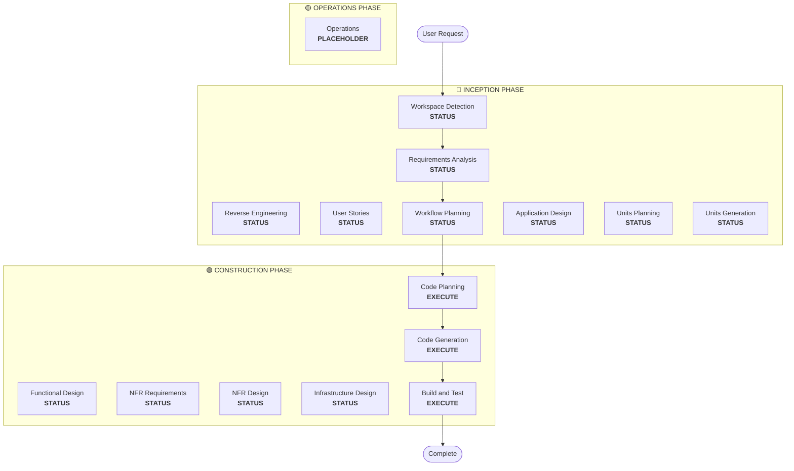

## WORKSPACE_DETECTION

Purpose: determine workspace state and check for existing AI-DLC projects.

### Steps

1. Check for existing AI-DLC project — check if `aidlc-docs/aidlc-state.md` exists: [COND] exists → resume from last phase (load context from previous phases), [COND] not exists → continue with new project assessment
2. Scan workspace for existing code — scan for source code files (.java, .py, .js, .ts, .jsx, .tsx, .kt, .kts, .scala, .groovy, .go, .rs, .rb, .php, .c, .h, .cpp, .hpp, .cc, .cs, .fs, etc.), check for build files (pom.xml, package.json, build.gradle, etc.), look for project structure indicators, identify workspace root directory (NOT aidlc-docs/). Record findings:

```markdown
## Workspace State
- **Existing Code**: [Yes/No]
- **Programming Languages**: [List if found]
- **Build System**: [Maven/Gradle/npm/etc. if found]
- **Project Structure**: [Monolith/Microservices/Library/Empty]
- **Workspace Root**: [Absolute path]
```

3. Determine next phase — [COND] workspace empty (no existing code) → set `brownfield = false`, next: Requirements Analysis. [COND] workspace has existing code → set `brownfield = true`, check for existing reverse engineering artifacts in `aidlc-docs/inception/reverse-engineering/`: [COND] artifacts exist → load them, skip to Requirements Analysis, [COND] no artifacts → next: Reverse Engineering
4. Create initial state file — create `aidlc-docs/aidlc-state.md`:

```markdown
# AI-DLC State Tracking

## Project Information
- **Project Type**: [Greenfield/Brownfield]
- **Start Date**: [ISO timestamp]
- **Current Stage**: INCEPTION - Workspace Detection

## Workspace State
- **Existing Code**: [Yes/No]
- **Reverse Engineering Needed**: [Yes/No]
- **Workspace Root**: [Absolute path]

## Code Location Rules
- **Application Code**: Workspace root (NEVER in aidlc-docs/)
- **Documentation**: aidlc-docs/ only
- **Structure patterns**: See code-generation.md Critical Rules

## Stage Progress
[Will be populated as workflow progresses]
```

5. Present completion message — for brownfield:

```markdown
# 🔍 Workspace Detection Complete

Workspace analysis findings:
• **Project Type**: Brownfield project
• [AI-generated summary of workspace findings in bullet points]
• **Next Step**: Proceeding to **Reverse Engineering** to analyze existing codebase...
```

For greenfield:

```markdown
# 🔍 Workspace Detection Complete

Workspace analysis findings:
• **Project Type**: Greenfield project
• **Next Step**: Proceeding to **Requirements Analysis**...
```

6. Automatically proceed — no user approval required (informational only). [COND] brownfield → Reverse Engineering (if no existing artifacts) | Requirements Analysis (if artifacts exist). [COND] greenfield → Requirements Analysis.

## REVERSE_ENGINEERING

Purpose: analyze existing codebase and generate comprehensive design artifacts.

Execute when: brownfield project detected (existing code found). Skip when: greenfield project. Rerun behavior: always rerun when brownfield detected, even if artifacts exist — ensures artifacts reflect current code state.

### Steps

1. Multi-package discovery:
   - 1.1 Scan workspace: all packages, package relationships via config files, package types (Application, CDK/Infrastructure, Models, Clients, Tests)
   - 1.2 Understand business context: core business the system implements, business overview of every package, list of business transactions
   - 1.3 Infrastructure discovery: CDK packages, Terraform (.tf files), CloudFormation (.yaml/.json templates), deployment scripts
   - 1.4 Build system discovery: build systems (Brazil, Maven, Gradle, npm), config files, build dependencies between packages
   - 1.5 Service architecture discovery: Lambda functions (handlers, triggers), container services (Docker/ECS configs), API definitions (Smithy models, OpenAPI specs), data stores (DynamoDB, S3, etc.)
   - 1.6 Code quality analysis: programming languages/frameworks, test coverage indicators, linting configurations, CI/CD pipelines

2. Generate business overview documentation — create `aidlc-docs/inception/reverse-engineering/business-overview.md`:

```markdown
# Business Overview

## Business Context Diagram
[Mermaid diagram showing the Business Context]

## Business Description
- **Business Description**: [Overall Business description of what the system does]
- **Business Transactions**: [List of Business Transactions that the system implements and their descriptions]
- **Business Dictionary**: [Business dictionary terms that the system follows and their meaning]

## Component Level Business Descriptions
### [Package/Component Name]
- **Purpose**: [What it does from the business perspective]
- **Responsibilities**: [Key responsibilities]
```

3. Generate architecture documentation — create `aidlc-docs/inception/reverse-engineering/architecture.md`:

```markdown
# System Architecture

## System Overview
[High-level description of the system]

## Architecture Diagram
[Mermaid diagram showing all packages, services, data stores, relationships]

## Component Descriptions
### [Package/Component Name]
- **Purpose**: [What it does]
- **Responsibilities**: [Key responsibilities]
- **Dependencies**: [What it depends on]
- **Type**: [Application/Infrastructure/Model/Client/Test]

## Data Flow
[Mermaid sequence diagram of key workflows]

## Integration Points
- **External APIs**: [List with purposes]
- **Databases**: [List with purposes]
- **Third-party Services**: [List with purposes]

## Infrastructure Components
- **CDK Stacks**: [List with purposes]
- **Deployment Model**: [Description]
- **Networking**: [VPC, subnets, security groups]
```

4. Generate code structure documentation — create `aidlc-docs/inception/reverse-engineering/code-structure.md`:

```markdown
# Code Structure

## Build System
- **Type**: [Maven/Gradle/npm/Brazil]
- **Configuration**: [Key build files and settings]

## Key Classes/Modules
[Mermaid class diagram or module hierarchy]

### Existing Files Inventory
[List all source files with their purposes - these are candidates for modification in brownfield projects]

**Example format**:
- `[path/to/file]` - [Purpose/responsibility]

## Design Patterns
### [Pattern Name]
- **Location**: [Where used]
- **Purpose**: [Why used]
- **Implementation**: [How implemented]

## Critical Dependencies
### [Dependency Name]
- **Version**: [Version number]
- **Usage**: [How and where used]
- **Purpose**: [Why needed]
```

5. Generate API documentation — create `aidlc-docs/inception/reverse-engineering/api-documentation.md`:

```markdown
# API Documentation

## REST APIs
### [Endpoint Name]
- **Method**: [GET/POST/PUT/DELETE]
- **Path**: [/api/path]
- **Purpose**: [What it does]
- **Request**: [Request format]
- **Response**: [Response format]

## Internal APIs
### [Interface/Class Name]
- **Methods**: [List with signatures]
- **Parameters**: [Parameter descriptions]
- **Return Types**: [Return type descriptions]

## Data Models
### [Model Name]
- **Fields**: [Field descriptions]
- **Relationships**: [Related models]
- **Validation**: [Validation rules]
```

6. Generate component inventory — create `aidlc-docs/inception/reverse-engineering/component-inventory.md`:

```markdown
# Component Inventory

## Application Packages
- [Package name] - [Purpose]

## Infrastructure Packages
- [Package name] - [CDK/Terraform] - [Purpose]

## Shared Packages
- [Package name] - [Models/Utilities/Clients] - [Purpose]

## Test Packages
- [Package name] - [Integration/Load/Unit] - [Purpose]

## Total Count
- **Total Packages**: [Number]
- **Application**: [Number]
- **Infrastructure**: [Number]
- **Shared**: [Number]
- **Test**: [Number]
```

7. Generate technology stack documentation — create `aidlc-docs/inception/reverse-engineering/technology-stack.md`:

```markdown
# Technology Stack

## Programming Languages
- [Language] - [Version] - [Usage]

## Frameworks
- [Framework] - [Version] - [Purpose]

## Infrastructure
- [Service] - [Purpose]

## Build Tools
- [Tool] - [Version] - [Purpose]

## Testing Tools
- [Tool] - [Version] - [Purpose]
```

8. Generate dependencies documentation — create `aidlc-docs/inception/reverse-engineering/dependencies.md`:

```markdown
# Dependencies

## Internal Dependencies
[Mermaid diagram showing package dependencies]

### [Package A] depends on [Package B]
- **Type**: [Compile/Runtime/Test]
- **Reason**: [Why dependency exists]

## External Dependencies
### [Dependency Name]
- **Version**: [Version]
- **Purpose**: [Why used]
- **License**: [License type]
```

9. Generate code quality assessment — create `aidlc-docs/inception/reverse-engineering/code-quality-assessment.md`:

```markdown
# Code Quality Assessment

## Test Coverage
- **Overall**: [Percentage or Good/Fair/Poor/None]
- **Unit Tests**: [Status]
- **Integration Tests**: [Status]

## Code Quality Indicators
- **Linting**: [Configured/Not configured]
- **Code Style**: [Consistent/Inconsistent]
- **Documentation**: [Good/Fair/Poor]

## Technical Debt
- [Issue description and location]

## Patterns and Anti-patterns
- **Good Patterns**: [List]
- **Anti-patterns**: [List with locations]
```

10. Create timestamp file — create `aidlc-docs/inception/reverse-engineering/reverse-engineering-timestamp.md`:

```markdown
# Reverse Engineering Metadata

**Analysis Date**: [ISO timestamp]
**Analyzer**: AI-DLC
**Workspace**: [Workspace path]
**Total Files Analyzed**: [Number]

## Artifacts Generated
- [x] architecture.md
- [x] code-structure.md
- [x] api-documentation.md
- [x] component-inventory.md
- [x] technology-stack.md
- [x] dependencies.md
- [x] code-quality-assessment.md
```

11. Update state tracking — update `aidlc-docs/aidlc-state.md`:

```markdown
## Reverse Engineering Status
- [x] Reverse Engineering - Completed on [timestamp]
- **Artifacts Location**: aidlc-docs/inception/reverse-engineering/
```

12. Present completion message:

```markdown
# 🔍 Reverse Engineering Complete

[AI-generated summary of key findings from analysis in the form of bullet points]

> **📋 <u>**REVIEW REQUIRED:**</u>**  
> Please examine the reverse engineering artifacts at: `aidlc-docs/inception/reverse-engineering/`

> **🚀 <u>**WHAT'S NEXT?**</u>**
>
> **You may:**
>
> 🔧 **Request Changes** - Ask for modifications to the reverse engineering analysis if required
> ✅ **Approve & Continue** - Approve analysis and proceed to **Requirements Analysis**
```

13. Wait for user approval — [REQ] do not proceed until user explicitly approves. [REQ] log user response in audit.md with complete raw input.

## REQUIREMENTS_ANALYSIS

Assume role: product owner. Adaptive phase: always executes. Detail level adapts to problem complexity. See @common/workflow-rules.md DEPTH_LEVELS for adaptive depth.

Prerequisites: Workspace Detection complete, Reverse Engineering complete (if brownfield).

### Steps

1. Load reverse engineering context (if available) — [COND] brownfield → load `aidlc-docs/inception/reverse-engineering/architecture.md`, `component-inventory.md`, `technology-stack.md`. Use these to understand existing system when analyzing request.

2. Analyze user request (intent analysis):
   - 2.1 Request clarity: Clear (specific, well-defined, actionable) | Vague (general, ambiguous, needs clarification) | Incomplete (missing key information)
   - 2.2 Request type: New Feature | Bug Fix | Refactoring | Upgrade | Migration | Enhancement | New Project
   - 2.3 Initial scope estimate: Single File | Single Component | Multiple Components | System-wide | Cross-system
   - 2.4 Initial complexity estimate: Trivial | Simple | Moderate | Complex

3. Determine requirements depth — based on request analysis: Minimal (clear and simple, no detailed requirements needed), Standard (needs clarification, functional and non-functional requirements needed), Comprehensive (complex project, high risk, detailed requirements with traceability)

4. Assess current requirements — analyze whatever user provided: intent statements/descriptions (already logged in audit.md), existing requirements documents, pasted content or file references. Convert non-markdown documents to markdown.

5. Thorough completeness analysis — [REQ] evaluate ALL areas, ask questions for ANY that are unclear: Functional Requirements (core features, user interactions, system behaviors), Non-Functional Requirements (performance, security, scalability, usability), User Scenarios (use cases, user journeys, edge cases, error scenarios), Business Context (goals, constraints, success criteria, stakeholder needs), Technical Context (integration points, data requirements, system boundaries), Quality Attributes (reliability, maintainability, testability, accessibility). When in doubt, ask questions.

5.1. Extension applicability questions — [REQ] scan all loaded extension files for `## Applicability Question` section. For each extension that declares one, include that question in clarifying questions file (Step 6). After receiving answers, record each extension enablement status in `aidlc-docs/aidlc-state.md` under `## Extension Configuration`:

```markdown
## Extension Configuration
| Extension | Enabled | Decided At |
|---|---|---|
| [Extension Name] | [Yes/No] | Requirements Analysis |
```

6. Generate clarifying questions (proactive approach) — ALWAYS create `aidlc-docs/inception/requirements/requirement-verification-questions.md` unless requirements exceptionally clear and complete. Ask questions about ANY missing, unclear, or ambiguous areas. Focus on functional requirements, non-functional requirements, user scenarios, business context. Request user to fill in all [Answer]: tags directly in questions document. Multiple-choice options: label A, B, C, D etc., mutually exclusive, ALWAYS include "X) Other (please describe after [Answer]: tag below)". Wait for user answers. [REQ] analyze ALL answers for ambiguities, create follow-up questions if needed. [REQ] keep asking until ALL ambiguities resolved OR user explicitly asks to proceed.

GATE: await user answers — DO NOT proceed to Step 7 until all questions in requirement-verification-questions.md answered and validated. Present question file to user and STOP.

7. Generate requirements document — [REQ] Step 6 gate must be passed. Create `aidlc-docs/inception/requirements/requirements.md`. Include intent analysis summary at top (user request, request type, scope estimate, complexity estimate). Include functional and non-functional requirements. Incorporate user answers to clarifying questions. Provide brief summary of key requirements.

8. Update state tracking — update `aidlc-docs/aidlc-state.md`:

```markdown
## Stage Progress
### 🔵 INCEPTION PHASE
- [x] Workspace Detection
- [x] Reverse Engineering (if applicable)
- [x] Requirements Analysis
```

9. Log and proceed — log approval prompt with timestamp in `aidlc-docs/audit.md`. Present completion message:

```markdown
# 🔍 Requirements Analysis Complete
```

   AI summary (optional): structured bullet-point summary — "Requirements analysis has identified [project type/complexity]:" — list key functional requirements, key non-functional requirements, architectural considerations or technical decisions if relevant. No workflow instructions. Factual and content-focused.

```markdown
> **📋 <u>**REVIEW REQUIRED:**</u>**  
> Please examine the requirements document at: `aidlc-docs/inception/requirements/requirements.md`


> **🚀 <u>**WHAT'S NEXT?**</u>**
>
> **You may:**
>
> 🔧 **Request Changes** -  Ask for modifications to the requirements if required based on your review 
> [IF User Stories will be skipped, add this option:]
> 📝 **Add User Stories** - Choose to Include **User Stories** stage (currently skipped based on project simplicity)  
> ✅ **Approve & Continue** - Approve requirements and proceed to **[User Stories/Workflow Planning]**

---
```

Include "Add User Stories" option only when User Stories stage will be skipped. Replace [User Stories/Workflow Planning] with actual next stage name. Wait for explicit user approval. Record approval response with timestamp. Update Requirements Analysis stage complete in aidlc-state.md.

## USER_STORIES

Purpose: convert requirements into user-centered stories with acceptance criteria, define user personas, establish shared understanding, provide testable specifications.

Prerequisites: Workspace Detection complete, Requirements Analysis recommended, Workflow Planning must indicate User Stories stage should execute.

### INTELLIGENT_ASSESSMENT

High priority (ALWAYS execute): new user features, user experience changes, multi-persona systems, customer-facing APIs, complex business logic, cross-team projects.

Medium priority (assess complexity): backend user impact, performance improvements with user-visible benefits, integration work affecting user workflows, data changes affecting user data/reports/analytics, security enhancements affecting user authentication/permissions. Execute if ANY: changes span multiple components/user touchpoints, ambiguity that stories could clarify, high business impact/risk, multiple business stakeholders, user acceptance testing required, multiple valid implementation approaches.

Skip only for simple cases: pure refactoring (zero user impact), isolated bug fixes (clear scope), infrastructure only (no user-facing effects), developer tooling (build processes, CI/CD), documentation updates (no functionality change).

Default decision: when in doubt, include user stories AND ask clarifying questions.

### PART_1_PLANNING

1. Validate user stories need [REQ] — assess request context (review original request/requirements, identify user-facing vs internal-only, assess complexity/scope, evaluate business stakeholder involvement), apply assessment criteria, document assessment decision in `aidlc-docs/inception/plans/user-stories-assessment.md`:

```markdown
# User Stories Assessment

## Request Analysis
- **Original Request**: [Brief summary]
- **User Impact**: [Direct/Indirect/None]
- **Complexity Level**: [Simple/Medium/Complex]
- **Stakeholders**: [List involved parties]

## Assessment Criteria Met
- [ ] High Priority: [List applicable criteria]
- [ ] Medium Priority: [List applicable criteria with complexity justification]
- [ ] Benefits: [Expected value from user stories]

## Decision
**Execute User Stories**: [Yes/No]
**Reasoning**: [Detailed justification]

## Expected Outcomes
- [List specific benefits user stories will provide]
- [How stories will improve project success]
```

2. Create story plan — assume role of product owner. Generate comprehensive plan with step-by-step execution checklist, each step with checkbox []. Focus on methodology and approach for converting requirements into user stories.
3. Generate context-appropriate questions — thoroughly analyze requirements and context to identify ALL areas where clarification improves story quality. Default to asking questions when ANY ambiguity or missing detail exists. See @common/workflow-rules.md QUESTION_FORMAT for formatting rules. EMBED questions using [Answer]: tag format. Question categories to evaluate (consider ALL): User Personas (user types, roles, characteristics, motivations), Story Granularity (detail level, story size, breakdown approach), Story Format (format preferences, template usage, documentation standards), Breakdown Approach (organization method, prioritization, grouping strategies), Acceptance Criteria (detail level, format, testing approach, validation methods), User Journeys (user workflows, interaction patterns, experience flows), Business Context (business goals, success metrics, stakeholder needs), Technical Constraints (technical limitations, integration requirements, system boundaries)
4. Include mandatory story artifacts in plan — ALWAYS include: generate stories.md with user stories following INVEST criteria, generate personas.md with user archetypes/characteristics, ensure stories are Independent/Negotiable/Valuable/Estimable/Small/Testable, include acceptance criteria for each story, map personas to relevant user stories
5. Present story options — include different approaches in plan document: User Journey-Based (stories follow user workflows), Feature-Based (organized around system features), Persona-Based (grouped by user types), Domain-Based (organized around business domains), Epic-Based (hierarchical epics with sub-stories). Explain trade-offs. Allow hybrid approaches with clear decision criteria.
6. Store story plan — save as `aidlc-docs/inception/plans/story-generation-plan.md` with all [Answer]: tags
7. Request user input — ask user to fill [Answer]: tags directly in plan document
8. Collect answers — wait for ALL [Answer]: tags completed
9. Analyze answers [REQ] — review all answers for: vague/ambiguous responses ("mix of", "somewhere between", "not sure", "depends", "maybe", "probably"), undefined criteria/terms, contradictory answers, missing generation details, answers combining options without clear decision rules, incomplete explanations, assumption-based responses
10. Mandatory follow-up questions — [COND] analysis reveals ANY ambiguous answers → create separate clarification questions file using [Answer]: tags. DO NOT proceed to approval until ALL ambiguities resolved. Ask follow-up for every unclear response.
11. Avoid implementation details — focus on story creation methodology, not prioritization or development tasks
12. Log approval prompt — log with timestamp in `aidlc-docs/audit.md`, ISO 8601 format
13. Wait for explicit approval of plan — do not proceed until user explicitly approves. [COND] user requests changes → update plan, repeat.
14. Record approval response — log in `aidlc-docs/audit.md` with exact user response text

### PART_2_GENERATION

15. Load story generation plan — read from `aidlc-docs/inception/plans/story-generation-plan.md`, identify next uncompleted step (first [] checkbox), load context
16. Execute current step — perform exactly what step describes, generate story artifacts per plan, follow approved methodology/format, use story breakdown approach from plan
17. Update progress — mark completed step [x] in plan, update `aidlc-docs/aidlc-state.md`, save artifacts
18. Continue or complete — [COND] more steps → return to step 15, [COND] all complete → verify stories ready, ensure all mandatory artifacts generated
19. Log approval prompt — log with timestamp in `aidlc-docs/audit.md`
20. Present completion message:

```markdown
# 📚 User Stories Complete
```

   AI summary (optional): structured bullet-point summary — "User stories generation has created [description]:" — list key personas, user stories with counts/organization, story structure/compliance (INVEST criteria, acceptance criteria). No workflow instructions. Factual and content-focused.

```markdown
> **📋 <u>**REVIEW REQUIRED:**</u>**  
> Please examine the user stories and personas at: `aidlc-docs/inception/user-stories/stories.md` and `aidlc-docs/inception/user-stories/personas.md`


> **🚀 <u>**WHAT'S NEXT?**</u>**
>
> **You may:**
>
> 🔧 **Request Changes** -  Ask for modifications to the stories or personas based on your review  
> ✅ **Approve & Continue** - Approve user stories and proceed to **Workflow Planning**

---
```

21. Wait for explicit approval — do not proceed until user explicitly approves. [COND] user requests changes → update stories, repeat.
22. Record approval response — log in `aidlc-docs/audit.md` with exact user response text
23. Update progress — mark User Stories stage complete in `aidlc-state.md`

### CRITICAL_RULES

Planning phase: context-appropriate questions only, [REQ] mandatory answer analysis, no proceeding with ambiguity, explicit approval required.

Generation phase: NO HARDCODED LOGIC (only execute what is in plan), FOLLOW PLAN EXACTLY, UPDATE CHECKBOXES (mark [x] immediately), USE APPROVED METHODOLOGY, VERIFY COMPLETION.

Completion criteria: all planning questions answered and ambiguities resolved, story plan approved, all steps marked [x], all story artifacts generated (stories.md, personas.md), generated stories approved, stories ready for next stage.

## WORKFLOW_PLANNING

Purpose: determine which phases to execute and create comprehensive execution plan. Always executes after understanding requirements and scope.

### Steps

1. Load all prior context:
   - 1.1 Load reverse engineering artifacts (if brownfield): architecture.md, component-inventory.md, technology-stack.md, dependencies.md
   - 1.2 Load requirements analysis: requirements.md (includes intent analysis), requirement-verification-questions.md (with answers)
   - 1.3 Load user stories (if executed): stories.md, personas.md

2. Detailed scope and impact analysis:
   - 2.1 Transformation scope detection (brownfield only): architectural transformation (single component change vs architectural transformation, infrastructure vs application changes, deployment model changes), related component identification (infrastructure code, CDK stacks, API Gateway configs, load balancer requirements, networking changes, monitoring/logging adaptations), cross-package impact (CDK infrastructure packages, shared models, client libraries, test packages)
   - 2.2 Change impact assessment: user-facing changes, structural changes, data model changes, API changes, NFR impact. Application layer impact (code changes, dependencies, configuration, testing). Infrastructure layer impact (deployment model, networking, storage, scaling). Operations layer impact (monitoring, logging, alerting, deployment).
   - 2.3 Component relationship mapping (brownfield only): create component dependency graph:

```markdown
## Component Relationships
- **Primary Component**: [Package being changed]
- **Infrastructure Components**: [CDK/Terraform packages]
- **Shared Components**: [Models, utilities, clients]
- **Dependent Components**: [Services that call this component]
- **Supporting Components**: [Monitoring, logging, deployment]
```

   For each related component: change type (Major/Minor/Configuration-only), change reason, change priority (Critical/Important/Optional).
   - 2.4 Risk assessment: Low (isolated, easy rollback, well-understood) | Medium (multiple components, moderate rollback, some unknowns) | High (system-wide, complex rollback, significant unknowns) | Critical (production-critical, difficult rollback, high uncertainty)

3. Phase determination:
   - 3.1 User stories — already executed or skip? Execute IF: multiple user personas, user experience impact, acceptance criteria needed, team collaboration required. Skip IF: internal refactoring, bug fix with clear reproduction, technical debt reduction, infrastructure changes.
   - 3.2 Application design — execute IF: new components or services needed, component methods and business rules need definition, service layer design required, component dependencies need clarification. Skip IF: changes within existing component boundaries, no new components or methods, pure implementation changes.
   - 3.3 Design (units planning/generation) — execute IF: new data models or schemas, API changes or new endpoints, complex algorithms or business logic, state management changes, multiple packages require changes, infrastructure-as-code updates needed. Skip IF: simple logic changes, UI-only changes, configuration updates, straightforward implementations.
   - 3.4 NFR implementation — execute IF: performance requirements, security considerations, scalability concerns, monitoring/observability needed. Skip IF: existing NFR setup sufficient, no new NFR requirements, simple changes with no NFR impact.

4. Note adaptive detail — see @common/workflow-rules.md DEPTH_LEVELS. For each stage that will execute: all defined artifacts created, detail level within artifacts adapts to problem complexity, model determines appropriate detail based on problem characteristics.

5. Multi-module coordination analysis (brownfield only) — [COND] brownfield with multiple modules/packages:
   - 5.1 Analyze module dependencies: build system dependencies, dependency manifests, build-time vs runtime dependencies, API contracts and shared interfaces
   - 5.2 Determine update strategy: update sequence (dependency order), parallelization opportunities, coordination requirements (version compatibility, API contracts, deployment order), testing strategy (per-module vs integrated), rollback strategy
   - 5.3 Document coordination plan:

```markdown
## Module Update Strategy
- **Update Approach**: [Sequential/Parallel/Hybrid]
- **Critical Path**: [Modules that block other updates]
- **Coordination Points**: [Shared APIs, infrastructure, data contracts]
- **Testing Checkpoints**: [When to validate integration]
```

   Per module: update priority, dependency constraints, change scope (Major/Minor/Patch).

6. Generate workflow visualization — Mermaid flowchart showing all phases in sequence, EXECUTE or SKIP decision for each conditional phase. Styling rules:

```
style WD fill:#4CAF50,stroke:#1B5E20,stroke-width:3px,color:#fff
style CP fill:#4CAF50,stroke:#1B5E20,stroke-width:3px,color:#fff
style CG fill:#4CAF50,stroke:#1B5E20,stroke-width:3px,color:#fff
style BT fill:#4CAF50,stroke:#1B5E20,stroke-width:3px,color:#fff
style US fill:#BDBDBD,stroke:#424242,stroke-width:2px,stroke-dasharray: 5 5,color:#000
style Start fill:#CE93D8,stroke:#6A1B9A,stroke-width:3px,color:#000
style End fill:#CE93D8,stroke:#6A1B9A,stroke-width:3px,color:#000

linkStyle default stroke:#333,stroke-width:2px
```

   Style guidelines: Completed/Always execute: `fill:#4CAF50,stroke:#1B5E20,stroke-width:3px,color:#fff` (Material Green). Conditional EXECUTE: `fill:#FFA726,stroke:#E65100,stroke-width:3px,stroke-dasharray: 5 5,color:#000` (Material Orange). Conditional SKIP: `fill:#BDBDBD,stroke:#424242,stroke-width:2px,stroke-dasharray: 5 5,color:#000` (Material Gray). Start/End: `fill:#CE93D8,stroke:#6A1B9A,stroke-width:3px,color:#000` (Material Purple). Phase containers: lighter Material colors (INCEPTION: #BBDEFB, CONSTRUCTION: #C8E6C9, OPERATIONS: #FFF59D).

7. Create execution plan document — create `aidlc-docs/inception/plans/execution-plan.md`:

```markdown
# Execution Plan

## Detailed Analysis Summary

### Transformation Scope (Brownfield Only)
- **Transformation Type**: [Single component/Architectural/Infrastructure]
- **Primary Changes**: [Description]
- **Related Components**: [List]

### Change Impact Assessment
- **User-facing changes**: [Yes/No - Description]
- **Structural changes**: [Yes/No - Description]
- **Data model changes**: [Yes/No - Description]
- **API changes**: [Yes/No - Description]
- **NFR impact**: [Yes/No - Description]

### Component Relationships (Brownfield Only)
[Component dependency graph]

### Risk Assessment
- **Risk Level**: [Low/Medium/High/Critical]
- **Rollback Complexity**: [Easy/Moderate/Difficult]
- **Testing Complexity**: [Simple/Moderate/Complex]

## Workflow Visualization



**Note**: Replace STATUS placeholders with actual phase status (COMPLETED/SKIP/EXECUTE) and apply appropriate styling

## Phases to Execute

### 🔵 INCEPTION PHASE
- [x] Workspace Detection (COMPLETED)
- [x] Reverse Engineering (COMPLETED/SKIPPED)
- [x] Requirements Elaboration (COMPLETED)
- [x] User Stories (COMPLETED/SKIPPED)
- [x] Execution Plan (IN PROGRESS)
- [ ] Application Design - [EXECUTE/SKIP]
  - **Rationale**: [Why executing or skipping]
- [ ] Units Planning - [EXECUTE/SKIP]
  - **Rationale**: [Why executing or skipping]
- [ ] Units Generation - [EXECUTE/SKIP]
  - **Rationale**: [Why executing or skipping]

### 🟢 CONSTRUCTION PHASE
- [ ] Functional Design - [EXECUTE/SKIP]
  - **Rationale**: [Why executing or skipping]
- [ ] NFR Requirements - [EXECUTE/SKIP]
  - **Rationale**: [Why executing or skipping]
- [ ] NFR Design - [EXECUTE/SKIP]
  - **Rationale**: [Why executing or skipping]
- [ ] Infrastructure Design - [EXECUTE/SKIP]
  - **Rationale**: [Why executing or skipping]
- [ ] Code Planning - EXECUTE (ALWAYS)
  - **Rationale**: Implementation approach needed
- [ ] Code Generation - EXECUTE (ALWAYS)
  - **Rationale**: Code implementation needed
- [ ] Build and Test - EXECUTE (ALWAYS)
  - **Rationale**: Build, test, and verification needed

### 🟡 OPERATIONS PHASE
- [ ] Operations - PLACEHOLDER
  - **Rationale**: Future deployment and monitoring workflows

## Package Change Sequence (Brownfield Only)
[If applicable, list package update sequence with dependencies]

## Estimated Timeline
- **Total Phases**: [Number]
- **Estimated Duration**: [Time estimate]

## Success Criteria
- **Primary Goal**: [Main objective]
- **Key Deliverables**: [List]
- **Quality Gates**: [List]

[IF brownfield]
- **Integration Testing**: All components working together
- **Operational Readiness**: Monitoring, logging, alerting working
```

8. Initialize state tracking — update `aidlc-docs/aidlc-state.md`:

```markdown
# AI-DLC State Tracking

## Project Information
- **Project Type**: [Greenfield/Brownfield]
- **Start Date**: [ISO timestamp]
- **Current Stage**: INCEPTION - Workflow Planning

## Execution Plan Summary
- **Total Stages**: [Number]
- **Stages to Execute**: [List]
- **Stages to Skip**: [List with reasons]

## Stage Progress

### 🔵 INCEPTION PHASE
- [x] Workspace Detection
- [x] Reverse Engineering (if applicable)
- [x] Requirements Analysis
- [x] User Stories (if applicable)
- [x] Workflow Planning
- [ ] Application Design - [EXECUTE/SKIP]
- [ ] Units Planning - [EXECUTE/SKIP]
- [ ] Units Generation - [EXECUTE/SKIP]

### 🟢 CONSTRUCTION PHASE
- [ ] Functional Design - [EXECUTE/SKIP]
- [ ] NFR Requirements - [EXECUTE/SKIP]
- [ ] NFR Design - [EXECUTE/SKIP]
- [ ] Infrastructure Design - [EXECUTE/SKIP]
- [ ] Code Planning - EXECUTE
- [ ] Code Generation - EXECUTE
- [ ] Build and Test - EXECUTE

### 🟡 OPERATIONS PHASE
- [ ] Operations - PLACEHOLDER

## Current Status
- **Lifecycle Phase**: INCEPTION
- **Current Stage**: Workflow Planning Complete
- **Next Stage**: [Next stage to execute]
- **Status**: Ready to proceed
```

9. Present plan to user:

```markdown
# 📋 Workflow Planning Complete

I've created a comprehensive execution plan based on:
- Your request: [Summary]
- Existing system: [Summary if brownfield]
- Requirements: [Summary if executed]
- User stories: [Summary if executed]

**Detailed Analysis**:
- Risk level: [Level]
- Impact: [Summary of key impacts]
- Components affected: [List]

**Recommended Execution Plan**:

I recommend executing [X] stages:

🔵 **INCEPTION PHASE:**
1. [Stage name] - *Rationale:* [Why executing]
2. [Stage name] - *Rationale:* [Why executing]
...

🟢 **CONSTRUCTION PHASE:**
3. [Stage name] - *Rationale:* [Why executing]
4. [Stage name] - *Rationale:* [Why executing]
...

I recommend skipping [Y] stages:

🔵 **INCEPTION PHASE:**
1. [Stage name] - *Rationale:* [Why skipping]
2. [Stage name] - *Rationale:* [Why skipping]
...

🟢 **CONSTRUCTION PHASE:**
3. [Stage name] - *Rationale:* [Why skipping]
4. [Stage name] - *Rationale:* [Why skipping]
...

[IF brownfield with multiple packages]
**Recommended Package Update Sequence**:
1. [Package] - [Reason]
2. [Package] - [Reason]
...

**Estimated Timeline**: [Duration]

> **📋 <u>**REVIEW REQUIRED:**</u>**  
> Please examine the execution plan at: `aidlc-docs/inception/plans/execution-plan.md`

> **🚀 <u>**WHAT'S NEXT?**</u>**
>
> **You may:**
>
> 🔧 **Request Changes** - Ask for modifications to the execution plan if required
> [IF any stages are skipped:]
> 📝 **Add Skipped Stages** - Choose to include stages currently marked as SKIP
> ✅ **Approve & Continue** - Approve plan and proceed to **[Next Stage Name]**
```

10. Handle user response — [COND] approved → proceed to next stage, [COND] changes requested → update plan, re-confirm, [COND] user wants to force include/exclude stages → update plan accordingly

11. Log interaction — log in `aidlc-docs/audit.md`:

```markdown
## Workflow Planning - Approval
**Timestamp**: [ISO timestamp]
**AI Prompt**: "Ready to proceed with this plan?"
**User Response**: "[User's COMPLETE RAW response]"
**Status**: [Approved/Changes Requested]
**Context**: Workflow plan created with [X] stages to execute

---
```

## APPLICATION_DESIGN

Purpose: high-level component identification and service layer design — identifying main functional components and responsibilities, defining component interfaces (not detailed business logic), designing service layer for orchestration, establishing component dependencies and communication patterns. Detailed business logic design happens later in Functional Design (per-unit, CONSTRUCTION phase).

Prerequisites: Context Assessment complete, Requirements Assessment recommended, Story Development recommended, execution plan indicates Application Design should execute.

### Steps

1. Analyze context — read `aidlc-docs/inception/requirements/requirements.md` and `aidlc-docs/inception/user-stories/stories.md`, identify key business capabilities and functional areas, determine design scope and complexity
2. Create application design plan — generate plan with checkboxes [] focusing on components, responsibilities, methods, business rules, services
3. Include mandatory design artifacts in plan — ALWAYS include:
   - [ ] Generate components.md with component definitions and high-level responsibilities
   - [ ] Generate component-methods.md with method signatures (business rules detailed later in Functional Design)
   - [ ] Generate services.md with service definitions and orchestration patterns
   - [ ] Generate component-dependency.md with dependency relationships and communication patterns
   - [ ] Validate design completeness and consistency
4. Generate context-appropriate questions — analyze requirements and stories to generate ONLY questions relevant to THIS application design. Use categories as inspiration, NOT mandatory checklist. Skip entire categories if not applicable. EMBED questions using [Answer]: tag format. Example categories (adapt as needed): Component Identification (only if component boundaries or organization unclear), Component Methods (only if method signatures need clarification — detailed business rules come later), Service Layer Design (only if service orchestration or boundaries ambiguous), Component Dependencies (only if communication patterns or dependency management unclear), Design Patterns (only if architectural style or pattern choice needs user input)
5. Store application design plan — save as `aidlc-docs/inception/plans/application-design-plan.md` with all [Answer]: tags
6. Request user input — ask user to fill [Answer]: tags directly in plan document
7. Collect answers — wait for ALL [Answer]: tags completed
8. Analyze answers [REQ] — review all answers for: vague/ambiguous responses ("mix of", "somewhere between", "not sure", "depends"), undefined criteria/terms, contradictory answers, missing design details, answers combining options without clear decision rules
9. Mandatory follow-up questions — [COND] analysis reveals ANY ambiguous answers → add specific follow-up questions using [Answer]: tags. DO NOT proceed to approval until all ambiguities resolved.
10. Generate application design artifacts:
    - `aidlc-docs/inception/application-design/components.md` (component name/purpose, responsibilities, interfaces)
    - `aidlc-docs/inception/application-design/component-methods.md` (method signatures per component, high-level purpose, input/output types — detailed business rules in Functional Design)
    - `aidlc-docs/inception/application-design/services.md` (service definitions, responsibilities, interactions/orchestration)
    - `aidlc-docs/inception/application-design/component-dependency.md` (dependency matrix, communication patterns, data flow diagrams)
    - `aidlc-docs/inception/application-design/application-design.md` (consolidates all design docs above into single doc)
11. Log approval — log prompt with timestamp in `aidlc-docs/audit.md`, ISO 8601 format
12. Present completion message:

```markdown
# 🏗️ Application Design Complete

[AI-generated summary of application design artifacts created in bullet points]

> **📋 <u>**REVIEW REQUIRED:**</u>**  
> Please examine the application design artifacts at: `aidlc-docs/inception/application-design/`

> **🚀 <u>**WHAT'S NEXT?**</u>**
>
> **You may:**
>
> 🔧 **Request Changes** - Ask for modifications to the application design if required
> [IF Units Generation is skipped:]
> 📝 **Add Units Generation** - Choose to include **Units Generation** stage (currently skipped)
> ✅ **Approve & Continue** - Approve design and proceed to **[Units Generation/CONSTRUCTION PHASE]**
```

13. Wait for explicit approval — do not proceed until user explicitly approves. [COND] user requests changes → update design, repeat.
14. Record approval response — log in `aidlc-docs/audit.md` with exact user response text
15. Update progress — mark Application Design stage complete in `aidlc-docs/aidlc-state.md`

## UNITS_GENERATION

Two integrated parts: Part 1 - Planning (create decomposition plan with questions, collect answers, analyze for ambiguities, get approval), Part 2 - Generation (execute approved plan to generate unit artifacts).

Definition: a unit of work is a logical grouping of stories for development purposes. For microservices, each unit becomes independently deployable service. For monoliths, single unit represents entire application with logical modules.

Terminology: "Service" for independently deployable components, "Module" for logical groupings within a service, "Unit of Work" for planning context.

Prerequisites: Context Assessment complete, Requirements Assessment recommended, Story Development recommended, Application Design phase REQUIRED, execution plan indicates Design phase should execute.

### PART_1_PLANNING

1. Create unit of work plan — generate plan with checkboxes [] for decomposing system into units of work
2. Include mandatory unit artifacts in plan — ALWAYS include:
   - [ ] Generate `aidlc-docs/inception/application-design/unit-of-work.md` with unit definitions and responsibilities
   - [ ] Generate `aidlc-docs/inception/application-design/unit-of-work-dependency.md` with dependency matrix
   - [ ] Generate `aidlc-docs/inception/application-design/unit-of-work-story-map.md` mapping stories to units
   - [ ] [COND] greenfield only → document code organization strategy in `unit-of-work.md` (see @construction/construction-rules.md CODE_GENERATION CRITICAL_RULES for structure patterns)
   - [ ] Validate unit boundaries and dependencies
   - [ ] Ensure all stories assigned to units
3. Generate context-appropriate questions — analyze requirements, stories, and application design to generate ONLY questions relevant to THIS decomposition. Use categories as inspiration, NOT mandatory checklist. Skip entire categories if not applicable. EMBED questions using [Answer]: tag format. Example categories (adapt as needed): Story Grouping (only if multiple stories and grouping strategy unclear), Dependencies (only if multiple units likely and integration approach ambiguous), Team Alignment (only if team structure or ownership unclear), Technical Considerations (only if scalability/deployment requirements differ across units), Business Domain (only if domain boundaries or bounded contexts unclear), Code Organization (greenfield multi-unit only — deployment model and directory structure preferences)
4. Store UOW plan — save as `aidlc-docs/inception/plans/unit-of-work-plan.md` with all [Answer]: tags
5. Request user input — ask user to fill [Answer]: tags directly in plan document
6. Collect answers — wait for ALL [Answer]: tags completed
7. Analyze answers [REQ] — review all answers for: vague/ambiguous responses, undefined criteria/terms, contradictory answers, missing generation details, answers combining options without clear decision rules
8. Mandatory follow-up questions — [COND] analysis reveals ANY ambiguous answers → add specific follow-up questions using [Answer]: tags. DO NOT proceed to approval until all ambiguities resolved.
9. Request approval — ask: "Unit of work plan complete. Review the plan in aidlc-docs/inception/plans/unit-of-work-plan.md. Ready to proceed to generation?" DO NOT PROCEED until user confirms.
10. Log approval — log prompt and response in audit.md with timestamp, ISO 8601 format
11. Update progress — mark Units Planning complete in aidlc-state.md

### PART_2_GENERATION

12. Load unit of work plan — read from `aidlc-docs/inception/plans/unit-of-work-plan.md`, identify next uncompleted step (first [] checkbox), load context
13. Execute current step — perform exactly what step describes, generate unit artifacts per plan, follow approved decomposition approach
14. Update progress — mark completed step [x] in plan, update `aidlc-docs/aidlc-state.md`, save artifacts
15. Continue or complete — [COND] more steps → return to step 12, [COND] all complete → verify units ready for design stages, mark Units Generation stage complete
16. Present completion message:

```markdown
# 🔧 Units Generation Complete

[AI-generated summary of units and decomposition created in bullet points]

> **📋 <u>**REVIEW REQUIRED:**</u>**  
> Please examine the units generation artifacts at: `aidlc-docs/inception/application-design/`

> **🚀 <u>**WHAT'S NEXT?**</u>**
>
> **You may:**
>
> 🔧 **Request Changes** - Ask for modifications to the units generation if required
> ✅ **Approve & Continue** - Approve units and proceed to **CONSTRUCTION PHASE**
```

17. Wait for explicit approval — do not proceed until user explicitly approves. [COND] user requests changes → update units, repeat.
18. Record approval response — log in `aidlc-docs/audit.md` with exact user response text
19. Update progress — mark Units Generation stage complete in `aidlc-docs/aidlc-state.md`

### CRITICAL_RULES

Planning phase: generate ONLY context-relevant questions, use [Answer]: tag format, analyze all answers for ambiguities, resolve ALL ambiguities with follow-up questions, get explicit user approval before generation.

Generation phase: NO HARDCODED LOGIC (only execute what is in plan), FOLLOW PLAN EXACTLY, UPDATE CHECKBOXES (mark [x] immediately), USE APPROVED APPROACH, VERIFY COMPLETION.

Completion criteria: all planning questions answered and ambiguities resolved, user approval obtained, all steps marked [x], all unit artifacts generated (`unit-of-work.md`, `unit-of-work-dependency.md`, `unit-of-work-story-map.md`), units verified and ready for per-unit design stages.
